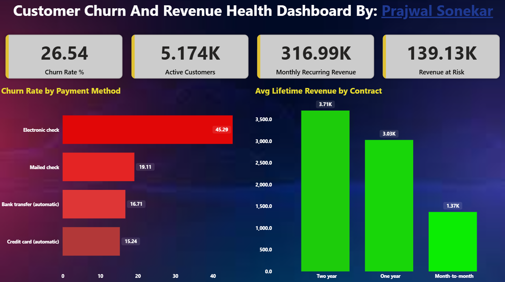

# Customer Churn Revenue Analysis

## Project Overview
This project analyzes customer churn and revenue leakage for a subscription-based SaaS product. 
The goal is to identify high-risk customer segments, quantify revenue impact, and provide 
data-driven recommendations to improve retention.

## Business Objectives
- Measure overall churn and retention
- Identify segments with highest churn
- Estimate monthly revenue at risk
- Analyze customer lifetime value (CLV)
- Support leadership decisions with dashboards

## Tech Stack
- Python (Pandas, NumPy)
- PostgreSQL
- Power BI

## Data Source
Telco Customer Churn Dataset  
https://www.kaggle.com/datasets/blastchar/telco-customer-churn

## Workflow
Raw CSV → Python Cleaning & Feature Engineering → PostgreSQL Warehouse → Power BI Dashboard

## Project Screenshots

### Executive Dashboard Overview

### Churn & Revenue Analysis Details

## Key KPIs
- Churn Rate  
- Active Customers  
- Monthly Recurring Revenue (MRR)  
- Revenue at Risk  
- Average Lifetime Value  

## Key Findings
- Month-to-month contracts show highest churn
- Early churners generate significantly lower lifetime revenue
- Auto-payment customers retain better

## Repository Contents
- notebooks/: Data cleaning and EDA
- sql/: Dashboard SQL queries
- powerbi/: Dashboard Screenshorts
- reports/: Business summary
- data/: Raw and processed data

## Author
Prajwal Sonekar
Aspiring Data Analyst
